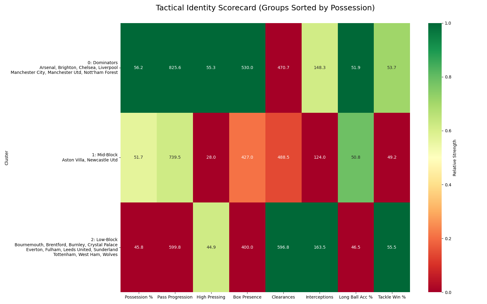

# **Premier League Tactical Clustering Analysis**

#### Project Overview

This project uses Unsupervised Machine Learning to categorize Premier League teams into distinct tactical archetypes based on their on-pitch performance data. Using data from FBref, the model analyzes 8 key dimensions of play—including ball progression, defensive volume, and passing efficiency—to group teams by playing style rather than league position.

#### Technical Implementation

-Data Engineering: Integrated four separate datasets (Defensive Actions, Passing, Possession, and Squad Stats) using a custom cleaning pipeline to handle multi-index headers and duplicate features.

-Dimensionality Reduction (PCA): Implemented Principal Component Analysis to reduce an 8-dimensional feature set into a 2D projection, allowing for clear visualization of tactical "space" while retaining maximum variance.

-Clustering (K-Means): Applied K-Means clustering ($K=3$) to identify tactical clusters. Results were programmatically sorted by Possession % to ensure a logical hierarchy (Dominators → Mid-Block → Low-Block).

-Scaling: Used StandardScaler to normalize features, ensuring that volume-based metrics (like Clearances) and percentage-based metrics (like Possession) carry equal weight in the model.

#### Visual Analysis

1\. The Tactical Map (PCA Projection)The scatter plot visualizes how teams relate to one another.

-X-Axis (PCA 1): Represents "Control \& Progression." Teams further to the right dominate the ball and move it deep into the opponent's half.

-Y-Axis (PCA 2): Represents "Style \& Defensive Volume." This distinguishes between high-pressing teams and those that prefer a compact, reactive defensive shape.

2\. Tactical Identity Scorecard

The heatmap provides the "Identity Card" for each cluster. By integrating team names directly into the visual, we can see exactly how a group's statistical profile matches its real-world reputation.

-Group 0 (Dominators): Green across Possession, Progression, and Box Presence. (e.g., Man City, Arsenal).

-Group 1 (Mid-Block): Balanced teams with high Tackle Win % and competitive progression. (e.g., Newcastle, Villa).

-Group 2 (Low-Block): High Green scores in Clearances and Interceptions, showing their strength in absorbing pressure and defending deep. (e.g., Everton, Forest).

#### Repository Structure

-analysis.py: The complete Python pipeline from data loading to visualization.

-data/: The 4 raw CSV files sourced from FBref.

-outputs/: The generated tactical map and scorecard.

